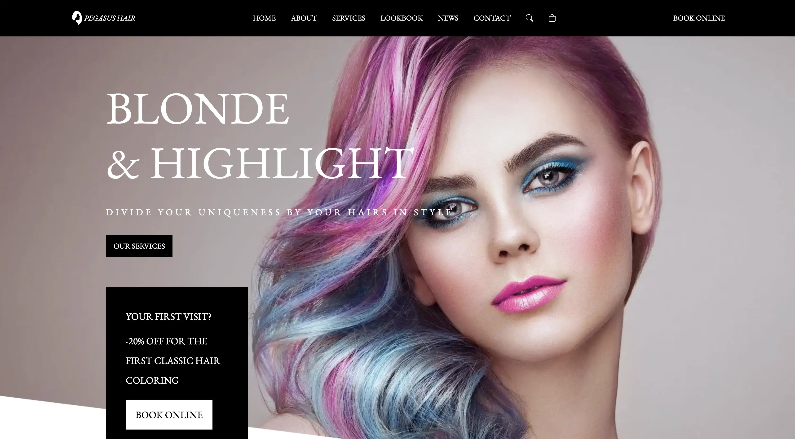

# 🍹 Mocktails Bar : [Visit Here](https://mocktails-bar.netlify.app/)

A simple app that generate a random mocktail from the [TheCocktailDB API](https://www.thecocktaildb.com/).

## How It's Made:

**Tech used:** HTML, CSS, JavaScript, [TheCocktailDB API](https://www.thecocktaildb.com/).

## Lessons Learned:

This project helped me learn more about APIs and to manage data coming from a fetch 

