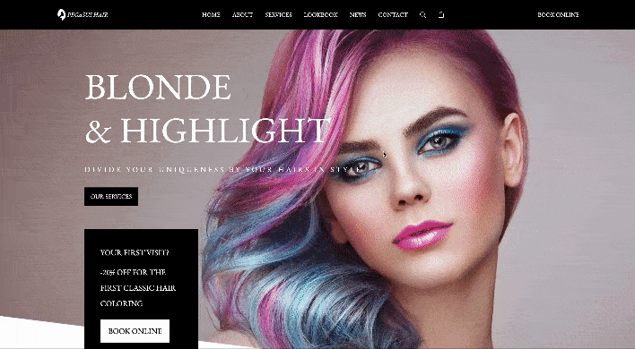

# 💇🏻‍♀️ Pegasus Hair Salon : [Visit Here](https://pegasushairsalon.netlify.app/)
A fully responsive landing page for Pegasus Hair Salon. The site highlights the salon’s services, and contact information, with a focus on a clean, modern aesthetic. Designed to provide an excellent user experience across desktop, tablet, and mobile devices.

## How It's Made:

**Tech used:** HTML, CSS, JavaScript.

## Lessons Learned:
While building the Pegasus Hair Salon landing page, I learned the importance of a mobile-first approach and the effectiveness of using CSS Flexbox for flexible layouts. I also gained experience with media queries for adaptive styling to ensure the site looks great on all devices. Additionally, I implemented transitions with JavaScript to enhance interactive elements.

## Other Projects:
Explore more of my recent projects on [My Portfolio](https://faliloukhouma.com).

